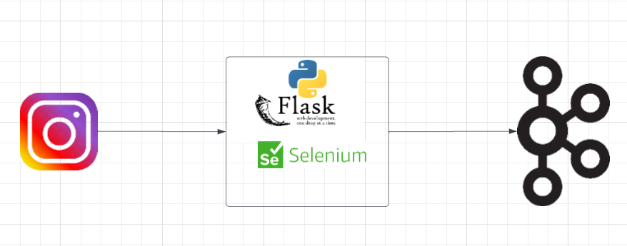

# Real Time Instagram Stories Data Collection Pipeline

This project sets up a real-time Instagram Stories data collection pipeline using Selenium and Docker Compose. It allows you to automate the process of collecting Instagram Stories in real-time.

## Prerequisites

Before you begin, ensure that you have the following prerequisites installed on your system:

- [Docker](https://www.docker.com/)
- [Docker Compose](https://docs.docker.com/compose/)

## Project Architecture



## Services

Here's an overview of the services included in this project:

### Selenium

Selenium is used for web automation to interact with Instagram and collect Stories data in real-time.

### Your Web Browser

You will need to configure Selenium to use a specific web browser (e.g., Chrome, Firefox) for Instagram automation. Make sure you have the appropriate web driver installed.
### ZooKeeper

ZooKeeper is used for distributed coordination and management. It plays a crucial role in maintaining configuration information, providing distributed synchronization, and more.

### Kafka

Kafka is a distributed streaming platform used for real-time data feeds. It serves as the central data pipeline for streaming data between producers and consumers.

### Producer

The producer service sends data to Kafka topics. It can be customized to generate and send data related to stock predictions to Kafka for processing.

### Consumer

The consumer service processes data from Kafka topics. It receives and analyzes data related to stock predictions, making it an essential component for real-time data processing.

### Flask Server

The Flask server provides an API for stock predictions. It serves as an interface for users and depends on Kafka for real-time data updates.

## Usage

1. Clone this repository to your local machine:

   ```bash
   git clone https://github.com/your-username/instagram-stories-pipeline.git
   cd instagram-stories-pipeline
